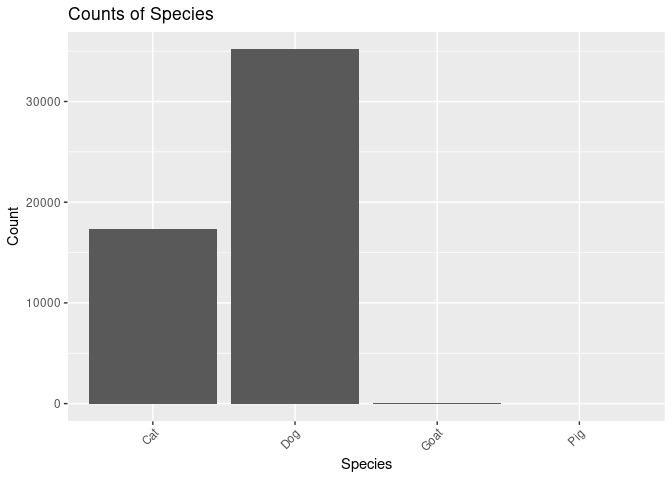
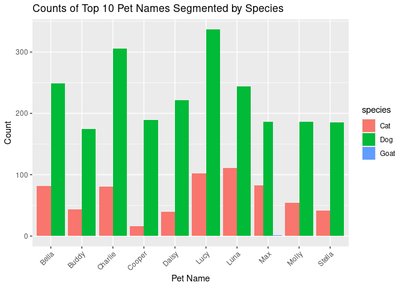
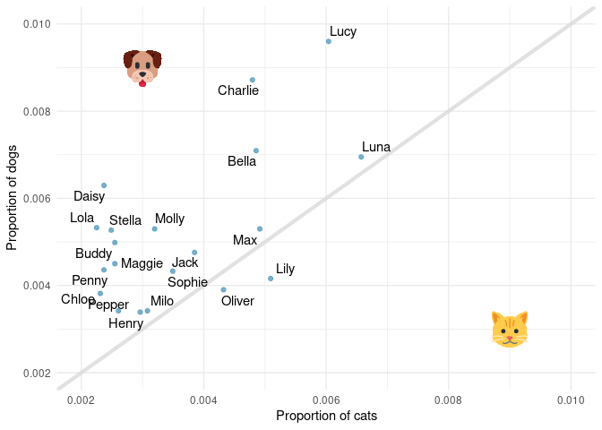

DSC 200 Lab Project -Term 2232
================
2024-05-20

**Student Name:\< Aminah Mohammead Almutairi\>**

**Student ID:\<2221001947\>**

**Deadline:** 23:59 on Sunday, 19 May 2024

**Total Points:** 20

## Loading Packages

``` r
library(tidyverse)
library(openintro)
library(ggrepel)
```

## Tasks

\`1. (2 points)

``` r
# Count the number of pets
num_pets <- nrow(seattlepets)
num_pets
```

    ## [1] 52519

Write your narrative here nrow() is a function in R that returns the
number of rows in a dataset. seattlepets is assumed to be the name of
your dataset containing information about pets. The result of
nrow(seattlepets) is assigned to the variable num_pets, which will
contain the total number of pets in the dataset.

\`2. (2 points)

``` r
# Count the number of variables
num_variables <- ncol(seattlepets)
num_variables
```

    ## [1] 7

Write your narrative below ncol() is a function in R that returns the
number of columns in a dataset. seattlepets is assumed to be the name of
your dataset containing information about pets. The result of
ncol(seattlepets) is assigned to the variable num_variables, which will
contain the total number of variables (columns) in the dataset.

\`3. (2 points)

``` r
# Count the frequency of each species
species_count <- table(seattlepets$species)
species_count
```

    ## 
    ##   Cat   Dog  Goat   Pig 
    ## 17294 35181    38     6

Write your narrative here table() is a function in R used to tabulate
the counts of data values.
seattlepets$species assumes that "seattlepets" is the name of your dataset and "species" is the column containing species information. table(seattlepets$species)
creates a table that shows the frequency of each unique species in the
dataset. The result is stored in the variable species_count, which holds
the frequency counts of each species.

\`4. (2 points)

``` r
# Count the frequency of each pet name
pet_name_frequency <- table(seattlepets$animal_name)

# Sort the frequency table in descending order
sorted_pet_names <- sort(pet_name_frequency, decreasing = TRUE)

# Display the top ten most common pet names
head(sorted_pet_names,10)
```

    ## 
    ##    Lucy Charlie    Luna   Bella     Max   Daisy   Molly    Jack    Lily  Stella 
    ##     439     387     355     331     270     261     240     232     232     227

Write your narrative here table(seattlepets\$animal_name) creates a
frequency table of pet names in the “seattlepets” dataset. sort() sorts
the frequency table in descending order of counts. By default, it sorts
in ascending order, but by specifying decreasing = TRUE, it sorts in
descending order. head(sorted_pet_names, 10) displays the first ten
entries of the sorted frequency table, which represent the top ten most
common pet names.

\`5. (2 points)

``` r
# Filter records for species Pig
pig_records <- filter(seattlepets, species == "Pig")

# Arrange the filtered records by pet names (animal_name)
sorted_pig_records <- arrange(pig_records, animal_name)

# Display the sorted pig records
sorted_pig_records
```

    ## # A tibble: 6 × 7
    ##   license_issue_date license_number animal_name species primary_breed
    ##   <date>             <chr>          <chr>       <chr>   <chr>        
    ## 1 2018-04-23         S116433        Atticus     Pig     Pot-Bellied  
    ## 2 2018-08-29         S146305        Coconut     Pig     Pot-Bellied  
    ## 3 2018-04-10         139975         Darla       Pig     Pot Bellied  
    ## 4 2018-07-27         731834         Millie      Pig     Pot-Bellied  
    ## 5 2018-08-29         S146306        Othello     Pig     Pot-Bellied  
    ## 6 2018-05-12         S141788        <NA>        Pig     Standard     
    ## # ℹ 2 more variables: secondary_breed <chr>, zip_code <chr>

Write your narrative here

filter(seattlepets, species == “Pig”) filters the dataset “seattlepets”
to include only records where the species is labeled as “Pig”. This
creates a new dataset named “pig_records”. arrange(pig_records,
animal_name) sorts the “pig_records” dataset by the column “animal_name”
in ascending order by default. The sorted pig records are then stored in
the variable sorted_pig_records. sorted_pig_records is then displayed,
showing the filtered and sorted records of pigs.

\`6. (2 points)

``` r
# Select only pet name (animal_name) and primary breed for species Goat
goat_records <- select(filter(seattlepets, species == "Goat"), animal_name, primary_breed)

# Arrange the selected records by pet names (animal_name)
sorted_goat_records <- arrange(goat_records, animal_name)

# Display the sorted goat records
sorted_goat_records
```

    ## # A tibble: 38 × 2
    ##    animal_name     primary_breed
    ##    <chr>           <chr>        
    ##  1 Abelard         Miniature    
    ##  2 Aggie           Miniature    
    ##  3 Arya            Miniature    
    ##  4 Beans           Miniature    
    ##  5 Brussels Sprout Miniature    
    ##  6 Darcy           Miniature    
    ##  7 Fawn            Miniature    
    ##  8 Fiona           Miniature    
    ##  9 Gavin           Standard     
    ## 10 Grace           Miniature    
    ## # ℹ 28 more rows

Write your narrative here

filter(seattlepets, species == “Goat”) filters the dataset “seattlepets”
to include only records where the species is labeled as “Goat”. select()
is used to choose specific columns from the filtered dataset. In this
case, it selects the columns “animal_name” (pet name) and
“primary_breed”. The selected records are stored in the variable
goat_records. arrange(goat_records, animal_name) sorts the
“goat_records” dataset by the column “animal_name” in ascending order by
default. The sorted goat records are stored in the variable
sorted_goat_records. Finally, sorted_goat_records is displayed, showing
the selected and sorted records for goats.

\`7. (2 points)

``` r
library(dplyr)

# Concatenate animal_name and species into a single column named pet
seattlepets <- mutate(seattlepets, pet = paste(animal_name, species, sep = " - "))

# Select license_number and pet, then arrange by pet
sorted_records <- select(seattlepets, license_number, pet) %>%
                  arrange(pet)

# Display the sorted records
sorted_records
```

    ## # A tibble: 52,519 × 2
    ##    license_number pet                                     
    ##    <chr>          <chr>                                   
    ##  1 8001665        "\"Luci\" Lucia Rosalin Wicksugal - Dog"
    ##  2 896557         "\"Mama\" Maya - Cat"                   
    ##  3 S147119        "\"Mo\" - Cat"                          
    ##  4 353597         "'Alani - Cat"                          
    ##  5 S143106        "'Murca - Dog"                          
    ##  6 573722         "- - Cat"                               
    ##  7 S126229        "1 - Cat"                               
    ##  8 S126230        "2 - Cat"                               
    ##  9 133239         "30 Weight - Cat"                       
    ## 10 S142492        "7's - Dog"                             
    ## # ℹ 52,509 more rows

Write your narrative here

The mutate() function from the dplyr package is used to create a new
column named “pet” in the “seattlepets” dataset. This column is created
by concatenating the columns “animal_name” and “species” with a
separator ” - “. select(seattlepets, license_number, pet) selects the
columns”license_number” and “pet” from the modified dataset. The %\>%
operator (pipe operator) is used to pass the result of the previous
operation (select()) as the first argument to the next operation
(arrange()). arrange(pet) sorts the dataset by the “pet” column in
ascending order. The sorted records are stored in the variable
sorted_records. Finally, sorted_records is displayed, showing the
selected and sorted records.

\`8. (2 points)

``` r
library(ggplot2)

# Create a bar plot of species counts
species_plot <- ggplot(seattlepets, aes(x = species)) +
                geom_bar() +
                labs(title = "Counts of Species", x = "Species", y = "Count") +
                theme(axis.text.x = element_text(angle = 45, hjust = 1))

# Display the plot
print(species_plot)
```

<!-- --> Write
your narrative here ggplot(seattlepets, aes(x = species)) initializes a
ggplot object with the dataset “seattlepets” and aesthetic mapping
specifying that the x-axis represents the “species” column. geom_bar()
adds a layer of bars to the plot, where each bar represents the count of
occurrences of a particular species. labs() sets the title and labels
for the axes. In the theme() function, axis.text.x = element_text(angle
= 45, hjust = 1) adjusts the appearance of the x-axis labels by rotating
them 45 degrees clockwise and adjusting their horizontal justification
to 1 (right-aligned). The variable species_plot holds the ggplot object.
Finally, print(species_plot) displays the plot.

\`9. (2 points)

``` r
top_10_names <- seattlepets %>% 
filter(animal_name %in% c( "Lucy"  , "Charlie" , "Luna" , "Bella" , "Max"    , 
                           "Daisy" , "Molly"   , "Jack" , "Lily"  , "Stella"))
top_10_names
```

    ## # A tibble: 2,974 × 8
    ##    license_issue_date license_number animal_name species primary_breed          
    ##    <date>             <chr>          <chr>       <chr>   <chr>                  
    ##  1 2018-11-25         S120480        Charlie     Dog     Retriever, Labrador    
    ##  2 2018-11-03         829563         Max         Dog     Retriever, Labrador    
    ##  3 2018-10-29         732106         Lily        Cat     Domestic Shorthair     
    ##  4 2018-11-25         895808         Max         Cat     Domestic Shorthair     
    ##  5 2018-11-26         834841         Daisy       Dog     Terrier, American Pit …
    ##  6 2018-12-13         8003804        Charlie     Dog     Border Collie          
    ##  7 2018-11-06         S125292        Jack        Cat     Domestic Shorthair     
    ##  8 2018-11-01         835179         Stella      Dog     Retriever, Labrador    
    ##  9 2018-12-14         950094         Molly       Dog     Retriever, Labrador    
    ## 10 2018-11-24         S137301        Lucy        Dog     Hound                  
    ## # ℹ 2,964 more rows
    ## # ℹ 3 more variables: secondary_breed <chr>, zip_code <chr>, pet <chr>

\`a. What does the above code chunk do?

``` r
# Create a subset of data for the top 10 most common pet names
top_10_names <- c("Lucy", "Charlie", "Luna", "Bella", "Max", "Cooper", "Daisy", "Buddy", "Molly", "Stella")
top_10_subset <- filter(seattlepets, animal_name %in% top_10_names)
```

\`b. Plot the counts of the pet names (animal_name) in top_10_names

``` r
# Plot the counts of the pet names segmented by species
pet_names_plot <- ggplot(top_10_subset, aes(x = animal_name, fill = species)) +
                  geom_bar(position = "dodge") +
                  labs(title = "Counts of Top 10 Pet Names Segmented by Species", x = "Pet Name", y = "Count") +
                  theme(axis.text.x = element_text(angle = 45, hjust = 1))

# Display the plot
print(pet_names_plot)
```

<!-- --> \`10.
(2 points)

    ## Warning: Using `size` aesthetic for lines was deprecated in ggplot2 3.4.0.
    ## ℹ Please use `linewidth` instead.
    ## This warning is displayed once every 8 hours.
    ## Call `lifecycle::last_lifecycle_warnings()` to see where this warning was
    ## generated.

    ## Warning in geom_image(mapping, data, inherit.aes = inherit.aes, na.rm = na.rm, : All aesthetics have length 1, but the data has 20 rows.
    ## ℹ Please consider using `annotate()` or provide this layer with data containing
    ##   a single row.
    ## All aesthetics have length 1, but the data has 20 rows.
    ## ℹ Please consider using `annotate()` or provide this layer with data containing
    ##   a single row.

<!-- --> \`What
names are more common for cats than dogs? The ones above the line or the
ones below the line?

\`Answer here…Dog:Lucy.Cat:Luna……………

\`Is the relationship between the two variables (proportion of cats with
a given name and proportion of dogs with a given name) positive or
negative? What does this mean in context of the data?

\`Answer here .Positive,as the popularity of a name for dogs
increases,so does the popularity of that name for cats…………
